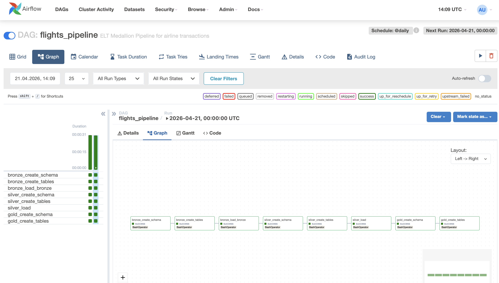
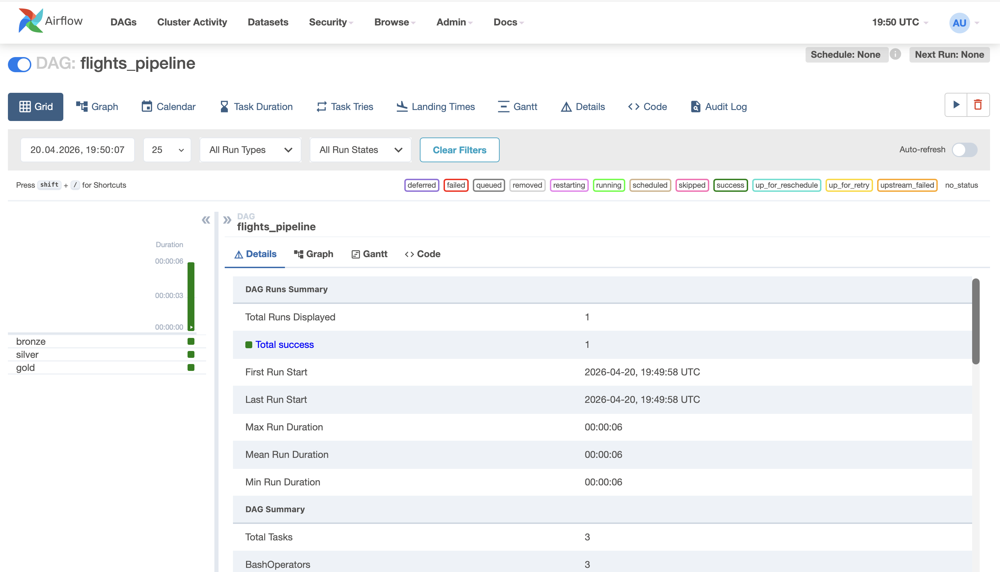

````markdown
# flights-elt-medallion-pipeline

ELT pipeline implementing **Medallion Architecture** (**Bronze, Silver, Gold**) to process airline transaction data and identify the most frequently used airlines based on transaction counts.

The project demonstrates workflow orchestration using **Apache Airflow**, layered data modeling, SQL-based transformations, and Python execution components.

---

# Project Overview

This project implements an ELT pipeline using the Medallion Architecture (**Bronze, Silver, Gold**) to process and analyze airline ticketing data.

The objective is to transform raw airline transaction data into structured and analytics-ready datasets that allow business analysis of airline popularity based on transaction volume.

The pipeline executes sequentially across Bronze, Silver, and Gold layers and is orchestrated using **Apache Airflow**.

---

# Initial Problem Statement

Airline ticketing data is often stored in raw and inconsistent formats, making it difficult to analyze operational trends such as:

- most frequently used airlines  
- popular routes  
- transaction volumes  
- customer booking behavior  

The purpose of this project is to clean, standardize, and aggregate the data into a usable analytical model.

---

# Dataset

The dataset used in this project is available on Kaggle:

https://www.kaggle.com/datasets/jayitabhattacharyya/hackerearth-arcenter-the-travelverse/data

It contains airline ticketing data including:

- transaction_key  
- ticketing_airline  
- marketing_airline  
- agency  
- issue_date  
- departure_date  
- origin  
- destination  
- country  
- cabin  

---

# Architecture (Medallion)

The pipeline follows the Medallion Architecture:

## Bronze Layer

Raw ingested source data stored in:

**TRAVEL_RAW**

## Silver Layer

Cleaned and structured relational model:

- AIRLINE  
- ROUTE  
- FACT_TRAVEL  

## Gold Layer

Aggregated reporting table:

**TRAVEL_GOLD**

---

## Data Flow

```text
Bronze → Silver → Gold
````

---

# Architecture Diagram


# Data Model


---

# Workflow Orchestration (Apache Airflow)

The pipeline is orchestrated using **Apache Airflow**.

Airflow is responsible for:

* task sequencing
* dependency management
* manual / scheduled execution
* monitoring runs
* retry handling

Pipeline execution order:

1. Bronze ingestion
2. Silver transformations
3. Gold aggregation

---

## Airflow DAG



## Successful Run



---

# Pipeline Execution Flow

## Bronze

Responsible for raw ingestion and staging.

Executed steps:

* create_schema.sql
* create_stage.sql
* create_stage_table.sql
* load_stage.sql
* create_tables.sql
* load_bronze.sql

## Silver

Responsible for cleansing, transformation, and structured modeling.

Includes:

* removing duplicates
* trimming text values
* handling nulls
* standardizing columns
* date conversion
* loading fact and dimension tables

Python execution component (`silver_job.py`) is used as an executable transformation step.

## Gold

Responsible for business-ready aggregation.

Includes:

* create_schema.sql
* create_tables.sql
* final aggregation query into TRAVEL_GOLD

---

# Data Pipeline Logic

1. Raw source data loaded into Bronze layer
2. Data cleaned and standardized in Silver layer
3. Dimension tables AIRLINE and ROUTE created
4. Fact table FACT_TRAVEL populated
5. Gold layer aggregates transactions by airline

---

# Data Cleaning (Silver Layer)

Applied transformations:

* removed NULL transaction keys
* removed duplicates using DISTINCT / deduplication logic
* trimmed text columns
* standardized airline names
* standardized route values
* converted date fields to DATE format
* prepared dimensional model

---

# Aggregation (Gold Layer)

The Gold layer joins fact and dimension tables and calculates:

* total transactions per airline
* route usage metrics
* analytical summary outputs

This creates an analytics-ready dataset for BI/reporting purposes.

---

# Idempotency Strategy

The pipeline was designed with repeatable execution in mind:

* deterministic SQL transformations
* re-runnable layer execution
* repeatable Bronze ingestion flow
* safe reprocessing logic
* Airflow retry support

---

# Technologies Used

* Python
* SQL
* Apache Airflow
* Docker
* Pandas / Spark-style processing concepts
* Medallion Architecture
* GitHub

---

# Repository Structure

```text
bronze/          raw ingestion SQL logic
silver/          cleansed data model + transformation jobs
gold/            aggregated analytics layer
orchestration/   Python wrapper scripts for layer execution

airflow/
├── dags/
├── docker-compose.yml
├── airflow-dag.png
└── airflow-success.png

db-architecture.png
high-level-architecture.png
README.md
```

---

# How to Run

## Clone repository

```bash
git clone <repo-url>
cd flights-elt-medallion-pipeline
```

## Start Airflow

```bash
cd airflow
docker compose up
```

## Open UI

```text
http://localhost:8080
```

## Trigger DAG

```text
flights_pipeline
```

---

# Why This Project Matters

This repository demonstrates practical Data Engineering skills:

* workflow orchestration
* DAG dependency management
* layered architecture design
* ELT pipelines
* SQL transformations
* analytical data modeling
* maintainable repository structure

---

# Author

**Julia Kramek**

```
```
