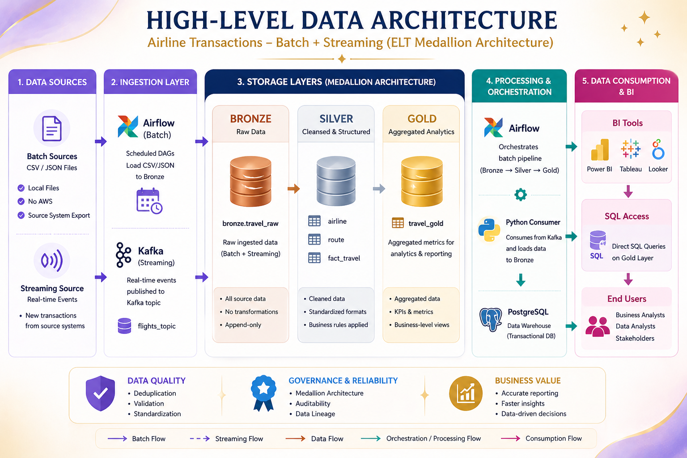
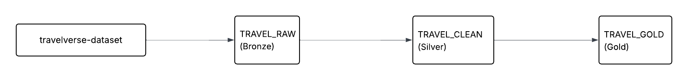

# flights-elt-medallion-pipeline

ELT pipeline implementing Medallion Architecture (Bronze, Silver, Gold) to process airline transaction data and identify the most frequently used airlines based on transaction counts.
The pipeline is orchestrated using a Python entrypoint, declarative SQL transformations, and Apache Spark as a scalable processing engine.

---

# Project Overview

This project implements an ELT pipeline using the Medallion Architecture (Bronze, Silver, Gold) to process and analyze airline ticketing data.

The goal of the project is to transform raw airline transaction data into a clean and aggregated dataset that enables analysis of airline popularity based on transaction volume.

The pipeline is orchestrated using Python and executes transformations sequentially across Bronze, Silver, and Gold layers.
The Silver layer uses Apache Spark as a scalable Big Data processing engine.

---

# Initial Problem Statement

Airline ticketing data is often stored in raw and inconsistent formats, making it difficult to analyze trends such as the most frequently used airlines.

The objective of this project is to clean and transform the data in order to identify which airlines generate the highest number of transactions and support further analytical use cases.

---

# Dataset

The dataset used in this project is available on Kaggle:

https://www.kaggle.com/datasets/jayitabhattacharyya/hackerearth-arcenter-the-travelverse/data

It contains airline ticketing data including:

* transaction_key
* ticketing_airline
* agency
* issue_date
* origin
* destination
* cabin

---

# Architecture (Medallion)

The pipeline follows the Medallion Architecture:

**Bronze (TRAVEL_RAW)** – raw ingested data
**Silver (AIRLINE, ROUTE, FACT_TRAVEL)** – cleaned and structured data model (Apache Spark processing)
**Gold (TRAVEL_GOLD)** – aggregated data for analytics

Data flows sequentially from Bronze → Silver → Gold.

---

## Architecture Diagram



## Data Model



---

# Orchestration

The pipeline is orchestrated using a single Python entrypoint:

```
python orchestration/run_pipeline.py
```

Execution order:

1. Bronze layer ingestion
2. Silver layer transformations (Apache Spark)
3. Gold layer aggregation

Each layer executes sequentially using a centralized pipeline orchestrator.

---

# Processing Engine

The Silver layer is processed using Apache Spark to provide scalable data transformations.
Spark session is initialized inside the Silver layer and used as the main Big Data processing engine.

This satisfies the requirement of using a scalable processing engine with a single pipeline entry point.

---

# Pipeline Execution Flow

The pipeline executes in the following order:

## Bronze

* create_schema.sql
* create_stage.sql
* create_stage_table.sql
* load_stage.sql
* create_tables.sql
* load_bronze.sql

## Silver (Spark)

* Spark session initialization
* Data transformation logic
* Data cleaning
* Business model transformation

## Gold

* create_tables.sql
* aggregation query (TRAVEL_GOLD)

The pipeline is executed sequentially using Python orchestrator.

---

# Data Pipeline

1. Load raw data into TRAVEL_RAW
2. Clean and transform data in Silver layer using Apache Spark
3. Create dimension tables AIRLINE and ROUTE
4. Create fact table FACT_TRAVEL
5. Aggregate data to create TRAVEL_GOLD

---

# Data Cleaning (Silver Layer)

The following transformations were applied:

* Removed NULL values from transaction_key
* Removed duplicates using DISTINCT
* Trimmed text fields (ticketing_airline, agency)
* Converted issue_date to DATE format
* Standardized airline names
* Standardized route data

---

# Aggregation (Gold Layer)

The Gold layer joins the fact and dimension tables and aggregates the data to calculate the number of transactions per airline and route.

This layer produces analytics-ready data.

---

# Idempotency Strategy

The pipeline is designed to be idempotent:

* Bronze layer uses append-only ingestion
* Silver layer uses deterministic Spark transformations
* Gold layer uses repeatable aggregation logic
* Tables created using CREATE IF NOT EXISTS
* Pipeline can be safely re-run multiple times

---

# Technologies Used

* Python (pipeline orchestration)
* SQL (data transformations)
* Apache Spark (Silver layer processing engine)
* Snowflake
* Medallion Architecture
* ELT pipeline design
* GitHub

---

# Repository Structure

```
bronze/          - raw ingestion layer  
silver/          - cleaned and structured tables  
gold/            - aggregated analytics layer  
orchestration/   - pipeline orchestrator (Python)  

db-architecture.png  
high-level-architecture.png  
README.md  
```

---

# How to Run

Clone the repository:

```
git clone <repo>
```

Go to project directory:

```
cd flights-elt-medallion-pipeline
```

Run pipeline:

```
python orchestration/run_pipeline.py
```

---

# Pipeline Flow

```
Raw Data
   ↓
Bronze (SQL ingestion)
   ↓
Silver (Apache Spark processing)
   ↓
Gold (aggregation)
   ↓
Analytics
```

---

# Author

Julia Kramek
